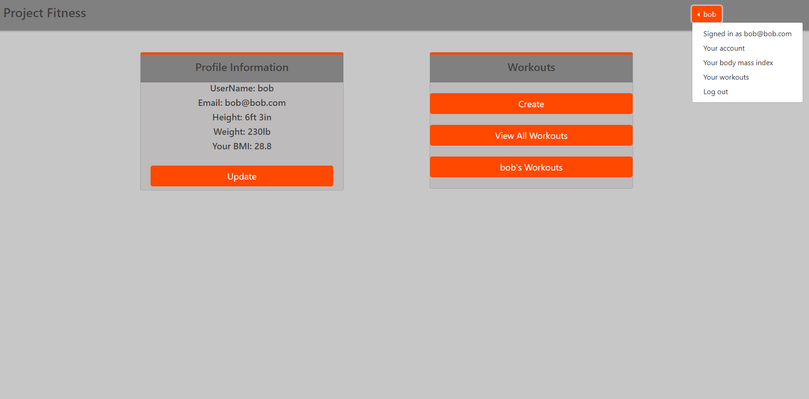

# [Project Fitness](https://young-hamlet-41284.herokuapp.com/)

Project fitness is a full stack node/mysql app designed for users to create workouts and track progress.

### Under the hood
* Node
* MySql
* Bootstrap
* * **Caber npm** This npm will allow users to create custom workouts
* **Body-mass-index npm** This npm will take in a user’s height and weight and will calculate their bmi from it
* connect-flash 
* cookie-parser 
* express-messages 
* express-session 
* express-validator 
* passport 
* passport-http 
* passport-local

### Deployment
* Heroku

### Images

## Guest Login
* email: guest@gmail.com
* password: 12345